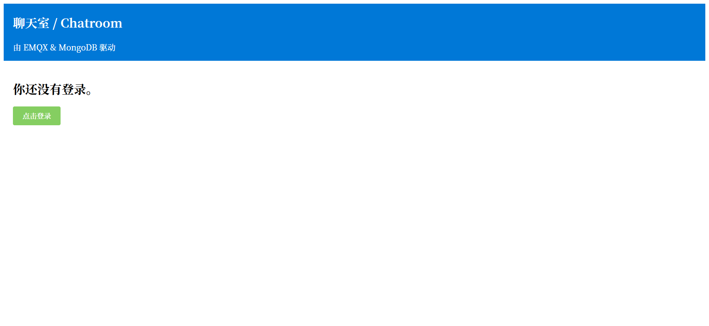
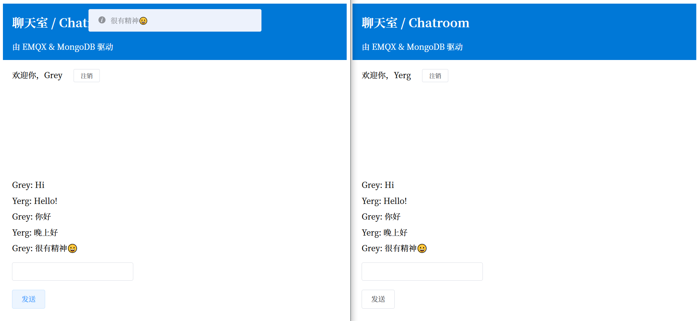
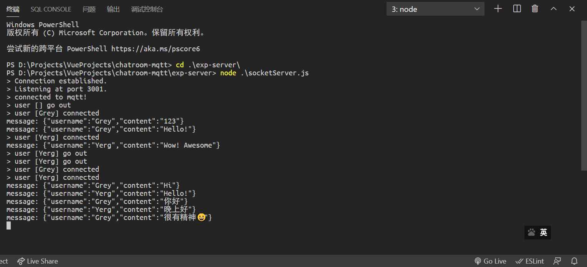

# MQTT-Chatroom

基于 MQTT 消息队列的简易聊天室。主要使用 Node 模块中的 Express 搭建服务器，Vue 编写前端，使用 socket.io 进行 WebSocket 通信。

## 环境准备

安装一个 MQTT 服务器并启动，推荐[EMQ X Broker](https://www.emqx.cn/)，此处不再赘述。

## 部署服务器

见 [exp-server](/exp-server)

## 部署前端网页

见 [chatroom-vue](/chatroom-vue)

## 服务逻辑

承载的 MQTT 的操作系统：CentOS 7

MQTT 服务器：EMQX Broker 4.1、NodeJS、Express、Socket.io、~~MongoDB~~

MQTT 客户端：SDK: MTQQ.js，Vue、JavaScript 等

- 用户登录 -> 从数据库检索用户是否存在：存在则检查密码，不存在则创建用户

- 客户端发送消息 -> 到达服务器 -> 到达 MQTT 消息队列

- MQTT 有消息到达 -> 发送到服务器 -> 发送到客户端

- 客户端（网页）使用 WebSocket 与服务器实现长连接，服务器向 MQTT 订阅消息，当 MQTT 有消息返回时，将消息推送到客户端。
